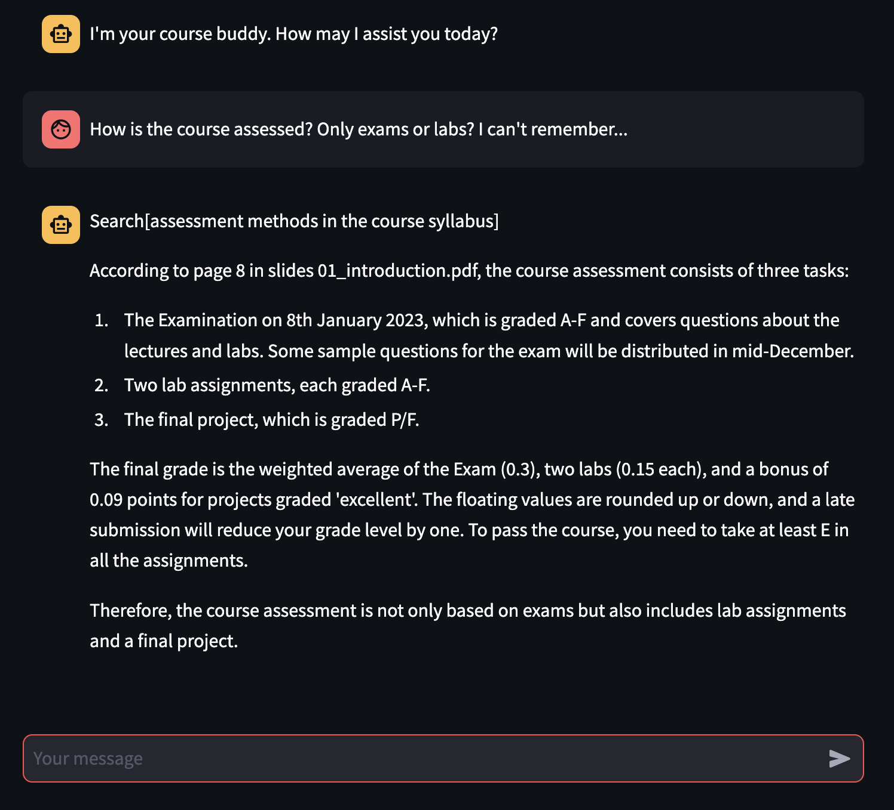
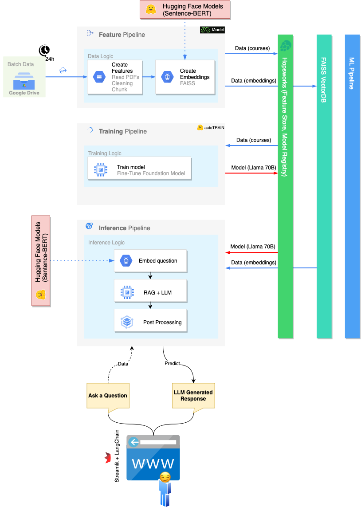

# BYOSC-Build-Your-Own-Scalable-Chatbots
## Introduction
When preparing for university exams, having a partner has been proven to be essential to discover
knowledge gaps and clarifying specific doubts on the topic treated during classes. While chatbots
based on LLMs such as ChatGPT, Phind and Clod are providing help to students already, they cannot
provide a lecture/material-specific help on the students’ university courses. We propose to create a
system to fine-tune chatbots on specific material of specific courses. Thanks to this, we will create
study buddies for the courses of a typical university student, able to answer doubts, generate questions
and more!

It's possible to test the chatbot at [this link](https://boysc-brioschi.streamlit.app/).

##
The implicit scope of the project (and of the entire course) is to build a scalable infrastructure that can host our MLops. For this reason, the traditional monolithic ML pipeline is split into three different processes: *Feature Pipeline*, *Training Pipeline*, *Inference Pipeline*.

### Feature Pipeline

The Feature Pipeline is in charge of:
- Downloading new available file from a public [shared folder](https://drive.google.com/drive/folders/1u2jMMh-hxSb93sL-BGsX9tYVeuA2wdcq)
- Generating transcripts of the files
- Uploading new transcript to hopsworks
- Using GPT 3.5 APIs to generate a valid Instruction Set for the fine-tuning of a foundation model
- Uploading such Instruction Set to hopsworks

#### Running the Feature Pipeline
There are several option to run the Feature Pipeline:
- Execute the `FeaturePipeline/Reading.ipynb` notebook
- Execute the `FeaturePipeline/FeaturePipeline.py` using `python3 FeaturePipeline/FeaturePipeline.py`

A copy of the latter is slightly modified in the file `FeaturePipeline/FeaturePipeline_modal.py` to make it runnable on the modal hosting service using  `modal [run|deploy] FeaturePipeline/FeaturePipeline.py`

### Training Pipeline

The Training Pipeline is in charge of:
- Retrieving the Instruction Set from hopsworks 
- Setting up a trainer instance using PEFT and LoRa techniques
- Running the training
- Uploading the result to HuggingFace

#### Running the Training Pipeline
To execute the Training Pipeline, run the notebook `TrainingPipeline/FineTuning.ipynb`

### Inference Pipeline

The Inference Pipeline is in charge of:
- Run a chatbot interface using Streamlit + Langchain
- Downloading transcripts of the material from hopsworks
- Computing embeddings of the original material using Sentence BERT
- Computing embeddings of the user's question using Sentence BERT
- Retrieve the best-matching material for a certain question
- Augmenting the chatbot's response using RAG

#### Running the Inference Pipeline
To execute the Inference Pipeline, run `streamlit run chatbot_app.py`

## Conclusions
While experimentally the fine-tuning process is not enough to make the foundational model consistently better than a non-fine-tuned one, the RAG-enabled chatbot is able not only to answer user's questions correctly following the original material, but it is also able to give (mostly) correct references of where the answer is taken from, essential feature for a student studying for an University exam!

### Future Work
Fine tuning doesn't work as well as intended due to the lack of material used and computational resources. As future work, we want to improve the knowledge-extraction process and use more computational power to address the problems shown in the report.  

